# Cloud Architecture - Order Management System

## 1. Architecture and Main Components

I've chosen **AWS** as the cloud platform because it's widely used and has good documentation. The system will be deployed using a simple microservices approach with three main parts:

### **Main Components:**

**Frontend (React App):**

- **AWS EC2**: Virtual server to run the React application
- **AWS S3**: Storage for static files (images, CSS, JS)
- **AWS CloudFront**: CDN to make the app load faster globally
- **AWS Route 53**: DNS management for custom domain

**.NET 8 API:**

- **AWS EC2**: Virtual server to run the .NET API
- **AWS RDS**: Managed database (PostgreSQL) for products and categories
- **NGINX**: Reverse proxy and load balancer

**Node.js Backend:**

- **AWS EC2**: Virtual server to run the Node.js app
- **AWS DocumentDB**: MongoDB-compatible database for storing orders
- **PM2**: Process manager to keep Node.js running
- **NGINX**: Reverse proxy and load balancer

**Basic AWS Services:**

- **AWS IAM**: User and permission management
- **AWS CloudWatch**: Basic monitoring and logging
- **AWS Certificate Manager**: Free SSL certificates
- **AWS Application Load Balancer**: SSL termination and traffic distribution

---

## 2. Architecture Diagram

```mermaid
graph TB
    subgraph "Internet"
        Users[👥 Users]
    end

    subgraph "DNS & SSL"
        R53[🌍 Route 53<br/>DNS]
        ACM[🔒 Certificate Manager<br/>SSL]
    end

    subgraph "AWS CloudFront"
        CF[🌐 CloudFront<br/>CDN]
    end

    subgraph "AWS Load Balancer"
        ALB[⚖️ Application Load Balancer<br/>SSL Termination]
    end

    subgraph "AWS EC2 Instances"
        subgraph "Frontend Server"
            FE[🟩 React App<br/>Port 3000]
            NGINX_FE[🔄 NGINX<br/>Port 80/443]
        end

        subgraph ".NET API Server"
            NET[🟨 .NET API<br/>Port 5039]
            NGINX_NET[🔄 NGINX<br/>Port 80/443]
        end

        subgraph "Node.js Server"
            NODE[🟦 Node.js App<br/>Port 5000]
            PM2[⚡ PM2 Process Manager]
            NGINX_NODE[🔄 NGINX<br/>Port 80/443]
        end
    end

    subgraph "Databases"
        RDS[🗄️ RDS PostgreSQL<br/>Products]
        MONGODB[📄 DocumentDB<br/>Orders]
    end

    subgraph "Storage & Monitoring"
        S3[🪣 S3 Bucket<br/>Static Files]
        CW[📊 CloudWatch<br/>Logs & Metrics]
    end

    Users --> R53
    R53 --> CF
    CF --> ALB
    ACM --> ALB

    ALB --> NGINX_FE
    ALB --> NGINX_NET
    ALB --> NGINX_NODE

    NGINX_FE --> FE
    NGINX_NET --> NET
    NGINX_NODE --> NODE
    NODE --> PM2

    FE --> NET
    FE --> NODE
    FE --> S3

    NET --> RDS
    NODE --> MONGODB

    FE --> CW
    NET --> CW
    NODE --> CW
    PM2 --> CW
```

---

## 3. Component Roles and Responsibilities

### **Frontend (React Application)**

**Role:** The React app that users interact with to browse products and place orders

**What it does:**

- Shows product catalog from the .NET API
- Handles user input for orders
- Sends order data to Node.js backend

**Automation:**

- Auto-scaling: If the server gets too busy, AWS will start more instances
- Basic health checks: AWS checks if the server is responding

**Monitoring:**

- CloudWatch logs: Basic application logs
- Simple metrics: CPU usage, memory usage, response times

**Security:**

- HTTPS: All traffic is encrypted (SSL from AWS Certificate Manager)
- Security groups: Basic firewall rules
- IAM roles: Limited permissions for the server

**Configuration:**

- Environment variables: API endpoints and settings
- S3 for static files: Images and CSS files
- NGINX configuration: Reverse proxy settings

### **.NET 8 API**

**Role:** Provides product and category data to the frontend

**What it does:**

- Serves product information from PostgreSQL database
- Handles category data
- Provides REST API endpoints

**Automation:**

- Database backups: AWS automatically backs up the database daily
- Auto-scaling: More instances if traffic increases

**Monitoring:**

- API response times
- Database connection status
- Error logs in CloudWatch
- Built-in .NET logging framework

**Security:**

- Database encryption: Data is encrypted at rest
- Network security: Only allows connections from the load balancer
- IAM authentication: Secure database access
- SSL termination at load balancer

**Configuration:**

- Database connection string from environment variables
- API settings and CORS configuration
- NGINX reverse proxy configuration

### **Node.js Backend**

**Role:** Processes orders and saves them to MongoDB

**What it does:**

- Receives order data from frontend
- Validates order information
- Saves orders to DocumentDB (MongoDB)

**Automation:**

- Auto-scaling based on order volume
- PM2 process management: Automatically restarts if app crashes
- Basic error handling and retries

**Monitoring:**

- Order processing success/failure rates
- Database connection status
- Application logs (Winston logging library)
- PM2 process monitoring and restart logs

**Security:**

- MongoDB encryption: Order data is encrypted
- Network isolation: Private network access only
- Secure credentials: Database passwords stored securely
- SSL termination at load balancer

**Configuration:**

- MongoDB connection string
- Order processing settings
- Log levels (Winston configuration)
- PM2 ecosystem file for process management

### **NGINX (Reverse Proxy)**

**Role:** Handles incoming requests and distributes them to applications

**What it does:**

- Serves as reverse proxy for all applications
- Handles static file serving
- Provides basic load balancing
- Manages SSL termination (if not using ALB)

**Automation:**

- Automatic restart if NGINX crashes
- Health checks for backend applications

**Monitoring:**

- Access logs and error logs
- Request/response metrics
- Backend health status

**Security:**

- Rate limiting configuration
- Basic DDoS protection
- Request filtering

**Configuration:**

- NGINX configuration files for each service
- SSL certificate configuration
- Upstream server definitions

### **PM2 (Process Manager)**

**Role:** Keeps Node.js applications running and manages them

**What it does:**

- Starts Node.js application
- Automatically restarts if app crashes
- Manages multiple Node.js processes
- Provides basic monitoring

**Automation:**

- Auto-restart on crashes
- Process monitoring and recovery
- Log rotation

**Monitoring:**

- Process status and health
- Memory and CPU usage
- Restart counts and error logs

**Configuration:**

- PM2 ecosystem file
- Startup scripts
- Log management settings

### **Databases**

**Role:** Store application data

**RDS PostgreSQL:**

- Stores products and categories
- Automated backups every day
- Basic monitoring for performance

**DocumentDB (MongoDB):**

- Stores order information
- Compatible with existing MongoDB code
- Automatic scaling and backups

**Security:**

- Both databases are encrypted
- Only accessible from the application servers
- Regular security updates from AWS

### **Load Balancer**

**Role:** Distributes traffic across multiple servers

**What it does:**

- Routes user requests to available servers
- Checks if servers are healthy
- Provides SSL termination (using AWS Certificate Manager)

**Automation:**

- Automatically detects unhealthy servers
- Routes traffic only to healthy instances

**Monitoring:**

- Traffic distribution metrics
- Server health status
- Response times

### **SSL & Domain Management**

**Role:** Provides secure HTTPS access and custom domain

**AWS Certificate Manager:**

- Provides free SSL certificates
- Automatic renewal
- No manual certificate management

**Route 53:**

- DNS management for custom domain
- Health checks and failover
- Domain registration (optional)

**What it does:**

- Users access the app via HTTPS
- Custom domain (e.g., myapp.com)
- SSL certificate automatically managed by AWS

### **CloudFront (CDN)**

**Role:** Makes the application load faster globally

**What it does:**

- Caches static content (images, CSS, JS) at edge locations
- Reduces load on main servers
- Provides global access

**Security:**

- HTTPS for all content
- Basic DDoS protection

### **S3 Storage**

**Role:** Stores static files

**What it does:**

- Stores images, CSS, JavaScript files
- Provides reliable file storage
- Integrates with CloudFront for fast delivery

**Security:**

- Files are encrypted
- Access controlled through IAM

### **CloudWatch Monitoring**

**Role:** Basic monitoring and logging

**What it does:**

- Collects logs from all applications
- Shows basic metrics (CPU, memory, disk)
- Sends alerts if something goes wrong

**Automation:**

- Automatic log collection
- Basic alerting for high CPU/memory usage

---

## Summary

This architecture provides:

- **Scalability**: Auto-scaling handles traffic spikes
- **Reliability**: Multiple servers, PM2 process management, and automated backups
- **Security**: SSL encryption, basic firewall rules, and access controls
- **Monitoring**: Simple logging (Winston, .NET logging, PM2) and alerting
- **Cost-effective**: Pay only for what you use
- **Professional**: Custom domain with SSL certificate

The system maintains the original functionality (React frontend, .NET API for products, Node.js for orders with MongoDB) while using AWS managed services and standard production tools for better reliability and easier maintenance.
