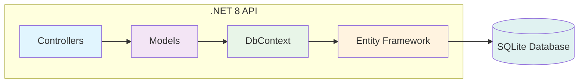
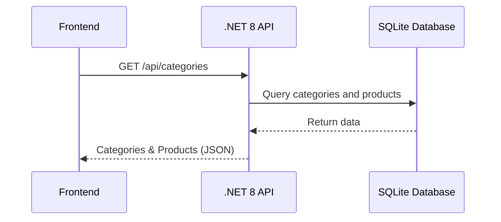

# 🟨 ProductAPI – .NET 8 Web API Backend

## 🌟 Overview

**ProductAPI** is a .NET 8 Web API that provides product categories and product data (in Hebrew) for the Order Management System. It uses Entity Framework Core with SQLite for storage and exposes a REST API for the frontend to fetch all categories and their products.

This backend is responsible for:

- Managing product categories and products (with Hebrew names/descriptions)
- Serving product data to the React frontend via a single API endpoint
- Storing data in a local SQLite database (auto-created and seeded on first run)

---

## ⚙️ How It Works

### Application Flow

1. **Startup** (`Program.cs`): Configures services, database connection, and middleware
2. **Database** (`ProductDbContext.cs`): Entity Framework context with seeded Hebrew product data
3. **Models** (`Product.cs`, `Category.cs`): Define data structure with navigation properties
4. **Controller** (`CategoriesController.cs`): Single endpoint that returns all categories with their products
5. **Response**: JSON data containing categories and nested products in Hebrew

### Key Functions

- `Program.cs` → `ConfigureServices()`: Sets up Entity Framework and SQLite
- `ProductDbContext.cs` → `OnModelCreating()`: Seeds database with Hebrew product data
- `CategoriesController.cs` → `GetCategories()`: Returns all categories with included products
- `ProductDbContext.cs` → `Categories.Include(c => c.Products)`: Eager loads products for each category

### Data Structure

```
Category (קטגוריה)
├── Id, Name (שם)
└── Products[]
    ├── Id, Name (שם), Description (תיאור), Price (מחיר)
    └── CategoryId (foreign key)
```

---

## 🏗️ System Architecture



---

## 🔄 Data Flow



---

## 📁 Project Structure

```
ProductAPI/
├── Controllers/         # API endpoints (CategoriesController)
├── Models/              # Entity models, DTOs, and DbContext
├── ProductDB.db         # SQLite database (auto-created)
├── Program.cs           # App entry point and configuration
├── appsettings.json     # Configuration (connection string, logging)
├── ProductAPI.csproj    # Project file and dependencies
├── nuget.config         # NuGet package source configuration
└── README.md            # This file
```

### 🔑 Key Files

- `Controllers/CategoriesController.cs` – API endpoint for categories
- `Models/Product.cs` – Product entity model
- `Models/Category.cs` – Category entity model
- `Models/ProductDbContext.cs` – Entity Framework context
- `Program.cs` – Application configuration and startup

---

## 🚀 Installation & Launch

### Prerequisites

- **.NET 8 SDK** ([Download](https://dotnet.microsoft.com/download/dotnet/8.0))

### Steps

```bash
cd ProductAPI
dotnet restore
dotnet run
# API available at http://localhost:5039/api/categories
```

---

## 🔗 API Endpoints

- `GET /api/categories` – Returns all categories and their products in Hebrew
- `GET /swagger` – Swagger UI documentation

**Full API URL:** `http://localhost:5039/api/categories`

---

## 🛠️ Troubleshooting

### General Issues

- **.NET not found**: Install .NET 8 SDK and ensure `dotnet` is in your PATH
- **Port 5039 in use**: Kill the process using the port or change the port in `appsettings.json`
- **Database issues**: Delete `ProductDB.db` and restart the app to recreate the database
- **CORS errors**: Ensure the frontend is running on an allowed port (default: 8080)

### NuGet Package Restore Issues

If you encounter `NU1101: Unable to find package` errors:

#### Option 1: Use Project-Level nuget.config (Recommended)

The project includes a `nuget.config` file that ensures NuGet.org is used as the package source. If you still get errors:

```bash
# Clear NuGet cache
dotnet nuget locals all --clear

# Restore packages
dotnet restore
```

#### Option 2: Add NuGet.org Source Manually

```bash
# Add the official NuGet.org source
dotnet nuget add source https://api.nuget.org/v3/index.json -n nuget.org

# List current sources to verify
dotnet nuget list source

# Clear cache and restore
dotnet nuget locals all --clear
dotnet restore
```

#### Option 3: Global NuGet Configuration

```bash
# Add NuGet.org source globally
dotnet nuget add source https://api.nuget.org/v3/index.json -n nuget.org --global

# Restore packages
dotnet restore
```

#### Common NuGet Issues

- **"Microsoft Visual Studio Offline Packages" error**: Your machine is configured to use only offline package sources. Use one of the solutions above.
- **Corporate network blocking**: Contact your IT department to allow access to `api.nuget.org`
- **Version conflicts**: Ensure all Entity Framework packages use the same version (8.0.x for .NET 8)

---

## 📝 Notes

- All product/category data is in Hebrew
- Prices are in Israeli Shekels (₪)
- The database is recreated and seeded on each startup (for development)
- This API is read-only for the frontend (no product editing via API)
- For production, consider using migrations and persistent storage

---

## 📚 More Info

- See the main [README.md](../README.md) for full system overview
- See `frontend/README.md` for frontend details
- See `backend/README.md` for Node.js backend details
