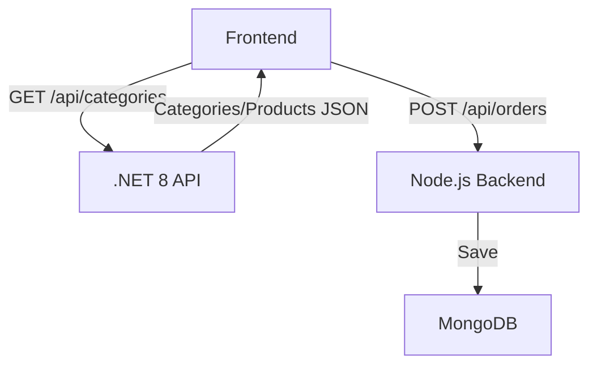
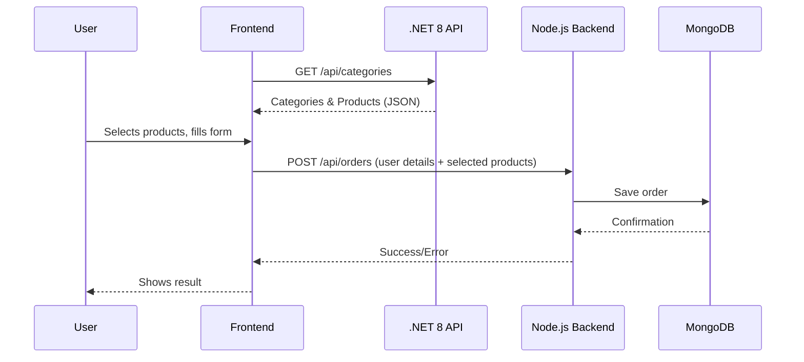

# 🛒 Order Management System – Full Stack (React + .NET 8 + Node.js + MongoDB)

## 🌟 Overview

This project is a full-stack order management system with a modern React frontend and **dual backend architecture**:

- **.NET 8 Web API** (port 5039): Provides product categories and product data (with Hebrew support)
- **Node.js + Express + MongoDB** (port 5000): Handles order submission and storage
- **Frontend (React + Redux Toolkit + Vite)**: User interface for product selection and order submission

---

## 🏗️ System Architecture



- **Frontend** fetches products from the .NET 8 API and submits orders to the Node.js backend.
- **.NET 8 API** manages product/category data (with Hebrew support) and serves it via REST.
- **Node.js backend** receives orders, validates, and stores them in MongoDB.

---

## 🔄 Data Flow



---

## 📁 Project Structure

```
project-root/
├── frontend/         # React app (product selection, order form)
├── backend/          # Node.js + Express backend (order management)
├── ProductAPI/       # .NET 8 Web API backend (product/category data)
└── README.md         # <--- YOU ARE HERE (main project overview)
```

---

## 🚀 Installation & Launch

### Prerequisites

- **Node.js** (v16+)
- **.NET 8 SDK**
- **MongoDB** (cloud)
- **npm**

### 1. Start the .NET 8 API Backend

**Prerequisites:**

- **.NET 8 SDK**: Download from [Microsoft .NET 8 Download Page](https://dotnet.microsoft.com/download/dotnet/8.0)

```bash
cd ProductAPI
dotnet restore
dotnet run
# API available at http://localhost:5039
```

### 2. Start the Node.js Backend

**Prerequisites:**

- **Database Key**: MongoDB connection string (will be provided - edit the .env file with this key)

```bash
cd backend
npm install
cp .env.example .env   # Edit with your MongoDB URI (use the key provided)
npm run dev
# API available at http://localhost:5000
```

### 3. Start the Frontend

```bash
cd frontend
npm install
npm run dev
# App available at http://localhost:8080
```

---

## 🔗 API Endpoints

- **.NET 8 API**: `GET /api/categories` (returns all categories and products)
- **Node.js Backend**: `POST /api/orders` (submits an order)

---

## 🛠️ Troubleshooting

- **CORS errors**: Ensure all backends allow the frontend port (8080)
- **MongoDB errors**: Check your `.env` and MongoDB server
- **.NET API not responding**: Ensure it's running on port 5039
- **Node.js backend not responding**: Ensure it's running on port 5000
- **Port conflicts**: Change the port in `.env` or kill existing processes

---

## 📝 Notes

- All product/category data is in Hebrew (from the .NET 8 API)
- Orders are stored in MongoDB (via Node.js backend)
- The system is modular: you can extend, replace, or scale each backend independently
- For more technical details, see the code and comments in each subproject.

---

## 📚 More Info

- See `ProductAPI/README.md` for .NET 8 backend details
- See `frontend/README.md` for frontend usage
- See `backend/README.md` for Node.js backend usage

---
