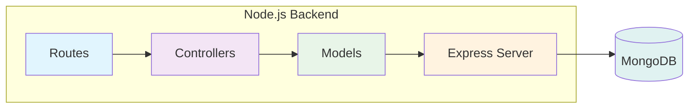
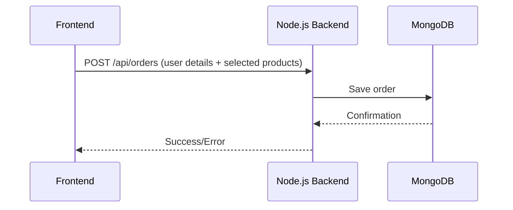

# 🟦 Backend – Node.js + Express + MongoDB

## 🌟 Overview

This is the **Node.js backend** for the Order Management System. It receives order data from the frontend, validates it, and saves it to MongoDB. This backend is responsible for order submission and management only.

---

## 🏗️ System Architecture



---

## 🔄 Data Flow



---

## 📁 Project Structure

```
backend/
├── src/
│   ├── controllers/      # Handles logic for orders
│   ├── models/           # Mongoose schemas
│   ├── routes/           # API endpoints
│   ├── env.ts            # Loads & checks environment variables
│   └── server.ts         # Starts the server
├── package.json          # Dependencies
├── .env.example          # Example environment variables
└── README.md             # This file
```

### 🔑 Key Files

- `src/controllers/orderController.ts` – Business logic for order submission
- `src/models/Order.ts` – Mongoose schema for orders
- `src/routes/orderRoutes.ts` – API endpoint for orders
- `src/server.ts` – Express server setup and MongoDB connection
- `.env.example` – Environment variable template

---

## 🚀 Installation & Launch

### Prerequisites

- **Node.js** (v16+)
- **MongoDB** (cloud)
- **npm**

### Steps

```bash
cd backend
npm install
cp .env.example .env   # Edit with your MongoDB URI
npm run dev
# API available at http://localhost:5000
```

---

## 🔗 API Endpoints

- `POST /api/orders` – Submit a new order

---

## 🛠️ Troubleshooting

- **CORS error?** Make sure the frontend port (8080) is allowed in `src/server.ts` CORS config
- **MongoDB error?** Check your `.env` file and MongoDB server
- **Port in use?** Change the `PORT` in `.env`
- **Validation error?** Make sure all required fields are sent from the frontend

---

## 📝 Notes

- This backend only handles order submission and storage
- All order data is stored in MongoDB
- The backend is stateless and does not persist sessions
- For full system context, see the main [README.md](../README.md)

---

## 📚 More Info

- See the main [README.md](../README.md) for full system overview
- See `frontend/README.md` for frontend details
- See `ProductAPI/README.md` for .NET 8 backend details

---
