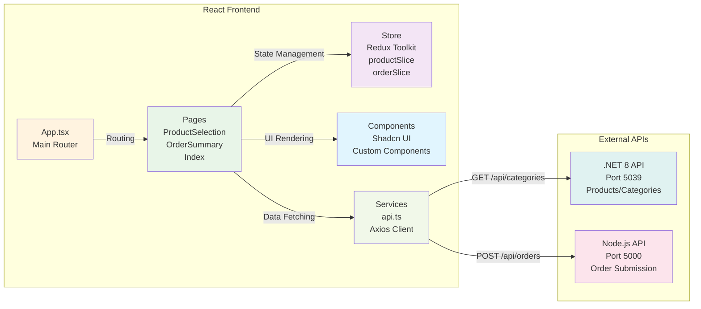
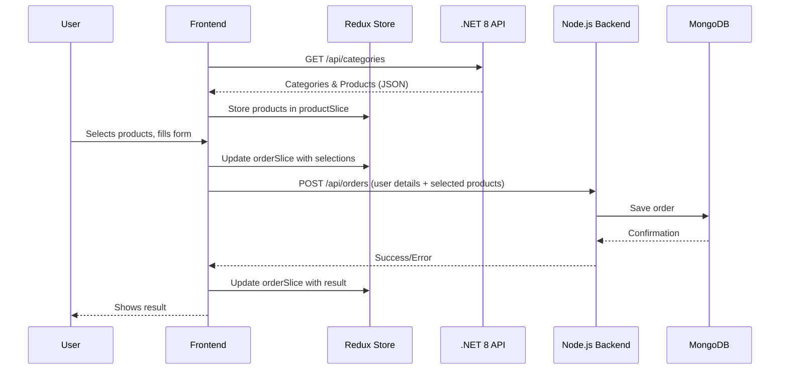

# 🟩 Frontend – React + Redux Toolkit

## 🌟 Overview

This is the **frontend** for the Order Management System. It provides a modern, responsive UI for users to select products (fetched from the .NET 8 API), fill out their details, and submit orders (to the Node.js backend). The app is built with React, Redux Toolkit, and Vite, and supports Hebrew product data.

### 🎯 Key Features

- **Product Selection**: Browse and select products from Hebrew catalog
- **Order Management**: Complete order forms with validation
- **Real-time State**: Redux-powered state management
- **Responsive Design**: Mobile-friendly UI with RTL support
- **API Integration**: Seamless connection to dual backend system

---

## 🏗️ System Architecture



---

## 🔄 Data Flow



---

## 📁 Project Structure

```
frontend/
├── src/
│   ├── pages/              # Main application pages
│   │   ├── Index.tsx       # Home page with navigation
│   │   ├── ProductSelection.tsx  # Product browsing & selection
│   │   ├── OrderSummary.tsx      # Order review & form submission
│   │   └── NotFound.tsx    # 404 error page
│   ├── store/              # Redux state management
│   │   ├── store.ts        # Redux store configuration
│   │   ├── productSlice.ts # Product state management
│   │   ├── orderSlice.ts   # Order state management
│   │   └── hooks.ts        # Redux hooks
│   ├── services/           # API and external services
│   │   └── api.ts          # Axios client for API calls
│   ├── components/         # Reusable UI components
│   │   └── ui/             # Shadcn UI component library
│   ├── hooks/              # Custom React hooks
│   │   ├── use-mobile.tsx  # Mobile detection hook
│   │   └── use-toast.ts    # Toast notification hook
│   ├── lib/                # Utility libraries
│   │   └── utils.ts        # Helper functions
│   ├── App.tsx             # Main application component
│   ├── main.tsx            # Application entry point
│   └── index.css           # Global styles
├── public/                 # Static assets
├── package.json            # Dependencies and scripts
├── vite.config.ts          # Vite configuration with proxy
├── tailwind.config.ts      # Tailwind CSS configuration
├── tsconfig.json           # TypeScript configuration
└── README.md               # This file
```

### 🔑 Key Files

- **`src/pages/ProductSelection.tsx`** – Main product browsing interface
- **`src/pages/OrderSummary.tsx`** – Order completion interface
- **`src/store/productSlice.ts`** – Product state management
- **`src/store/orderSlice.ts`** – Order state management
- **`src/services/api.ts`** – API communication layer
- **`vite.config.ts`** – Development configuration

---

## 🚀 Installation & Launch

### Prerequisites

- **Node.js** (v16+)
- **npm**
- **Both backends running** (see backend READMEs)

### Steps

```bash
cd frontend
npm install
npm run dev
# App will be available at http://localhost:8080
```

### Development Scripts

```bash
npm run dev          # Start development server
npm run build        # Build for production
npm run preview      # Preview production build
npm run lint         # Run ESLint
npm run type-check   # Run TypeScript type checking
```

---

## 🛠️ Troubleshooting

- **App won't load?** Make sure you're visiting the correct URL: http://localhost:8080
- **API errors?** Ensure both backends are running (ports 5000 and 5039)
- **Build errors?** Check TypeScript compilation with `npm run type-check`
- **CORS errors?** Verify backend CORS configurations allow port 8080

---

## 📝 Notes

- Fetches product/category data from the .NET 8 API
- Submits orders to the Node.js backend
- All product data is in Hebrew
- Uses Redux Toolkit for predictable state management
- Implements responsive design with Tailwind CSS

---

## 📚 More Info

- See the main [README.md](../README.md) for full system overview
- See `backend/README.md` for Node.js backend details
- See `ProductAPI/README.md` for .NET 8 backend details
